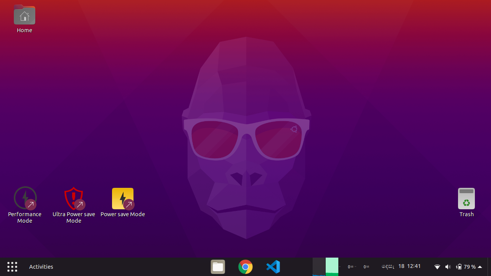

# Fresh Ubuntu Linux

Tired of configuring Gnome and apps after installing ubuntu everytime? 

This is what I do when I install minimal ubuntu on a new rig 


## Feel free to fry up this for your taste :-) 

# How to : 

Make sure you have a stable internet connection. 
Press `CTRL+ALT+T` to open a new terminal and type this in the terminal 


```bash
 sudo apt update 
 sudo apt install git 
 git clone https://github.com/hasindulanka/freshlinux.git 
 cd freshlinux/ 
 chmod +x *.sh 
 ./install.sh 
``` 
 
You'll be asked for the password , enter it. 

Now go for a walk or a swim. When you come back you'll see a messege like 

```
Press [Enter] to Logout
After you log in again, run ./config.gnome.after-relogin.sh [Without sudo]
```

So press Enter and log in back again 

Again, Press `CTRL+ALT+T` to open a new terminal and type this in the terminal 

` ./config.gnome.after-relogin.sh ` 

Done ! 

Your new shinny desktop will look something like this

 


# What get changed? 

## Desktop
* Gnome will change into system wide Yaru Dark theme 
* Top bar and dash will be merged into one panel and moved to the bottom. This is similar to KDE / MS Windows taskbar (Much better) 
* Bottom Panel will auto hide 
* Bottom Panel will contain an App launcher, Icon taskbar, CPU-RAM-Network monitor, datetime, system info panel and a Show desktop button 
* Desktop will have 3 additional icons - Power modes. These will only be effective when operating on battery. But make sure to use Performance mode when on AC 
    * **Performance mode** - Maximum performace setting like turbo boost, GPU modes even on battery 
    * **Powersave mode** - Saves power by limiting power hungry features 
    * **Ultra Powersave mode** - Maximize battery time by limiting performance. CPU will run at 400 MHz. *This makes my laptop run zoom/vlc for 12 hours* 
    These settings are also accesible as scripts in home folder 
* Workspaces are isolated (Taskbar will shown only apps in the current workspace)
* GRUB boot menu background image will be changed
* Your lap wont sleep or turn off display when you are away
* Power button will put computer into sleep. Closing the laptop lid will do nothing 

### Touchpad gestures 
    * Three finger tap - Middle click
    * Three finger pinch - Zoom in/out
    * Three finger swipe up/down - Change Workspace up/down
    * Three finger swipe left/right - Change Active window (alt+Tab and alt+shift_Tab)
    * Four finger swipe up - Desktop window overview 
    * Four finger swipe down - Close window (alt+F4)
    * Four finger swipe left/right - Navigate Right/Left (alt+Left / alt+Right)

## Things to do

* Increse SWAP memory to 8GB. Just run `sudo ./swap8GB.sh` 
* Install GPU drivers from `Apps` folder. Just run `sudo ./Apps/mesa-gpu-drivers.sh` 
* Reboot to get everything fully working (Like power plans)
* You should configure how many workspaces you want from `Gnome Tweaks` tool. (Installed) 
    * Warning : When using `Gnome Tweaks` it may overwrite some settings back to defaults. Keep your eye on these tweaks 
        * Suspend When Laptop lid is closed (Disabled) 
        * Extensions / Desktop Icons (Enabled) 
* Configure mount points of partitions 


## Softwares get installed 

* Apps
    * Visual Studio Code
    * Google Chrome 
    * zoom-client - (Yeah that Zoom meeting thingy) 
    * Microsoft Teams Desktop 
    * LibreOffice 
    * torbrowser 
    * XnConvert
    * vlc
    * cheese
    * vokoscreen-ng - Screen recorder
* Utilities
    * fdisk
    * g++
    * nano
    * screen
    * gedit
    * kate
    * git
    * wget
    * curl
    * ark
    * 7zip
    * ufw
    * gufw
    * make
    * htop 
    * libinput - Touchpad gestures
    * gnome-tweaks
    * chrome-gnome-shell 
    * tlp - Power manager 
    * ffmpeg 
    * gparted 
    * gnome-disk-utility
    * snapd
    * stacer 
    * openjdk-15-jre
    * dotnet-sdk-3.1
    * dotnet-sdk-5.0
    * resolvconf - This solves that DNS server not found issue on newer WIFI modules 
* Gnome Extentions 
    * gnome-shell-extension-dash-to-panel 
    * gnome-shell-extension-system-monitor 


# How to Customise 

This installs and configures everything (Excluding Apps folder)

` ./install.essentials.sh ; ./install.apps.sh ; ./install.office.sh ; ./config.desktop.sh ; /config.gnome.sh ; sudo apt -y dist-upgrade  `

## You can change this or edit the classified files. Just fork this template repo and start building your own 
# Try adding some chilly and pepper if it doesn't taste well 
